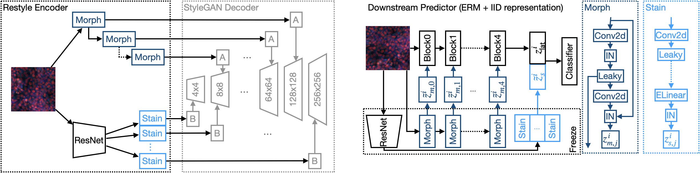
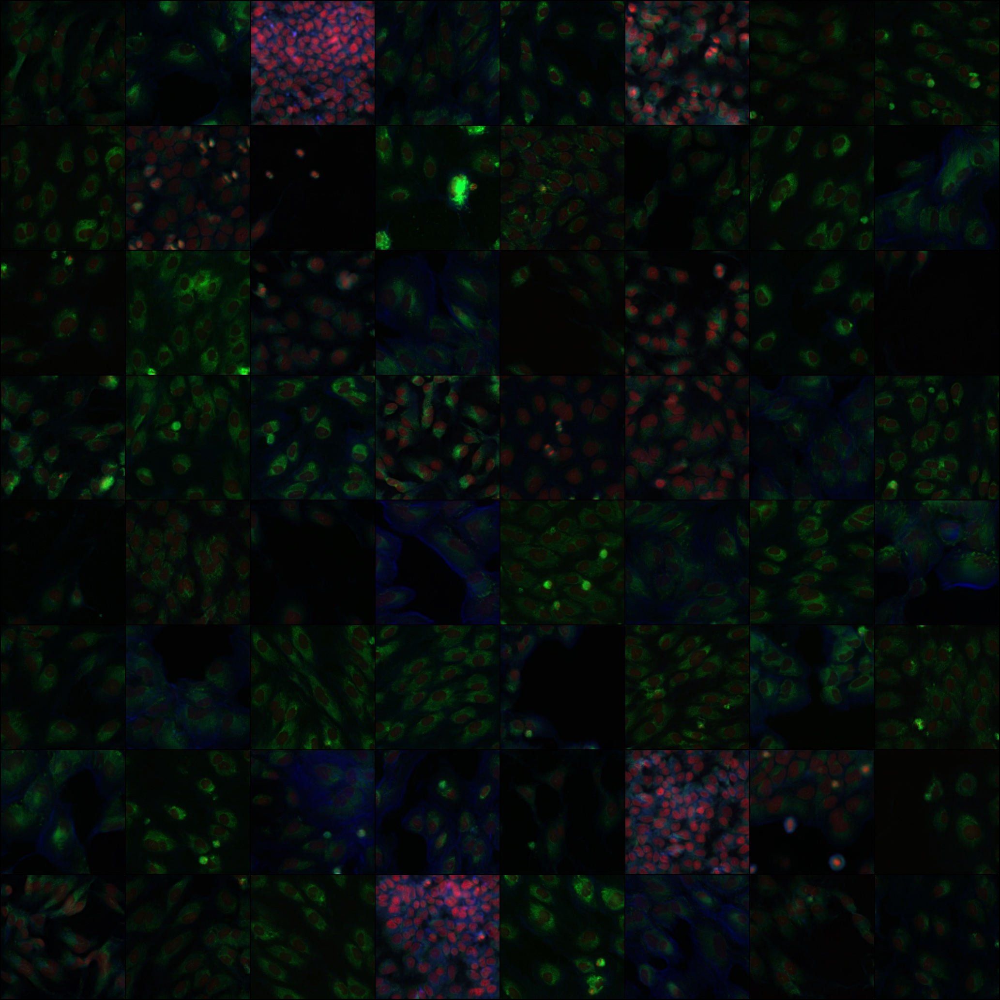
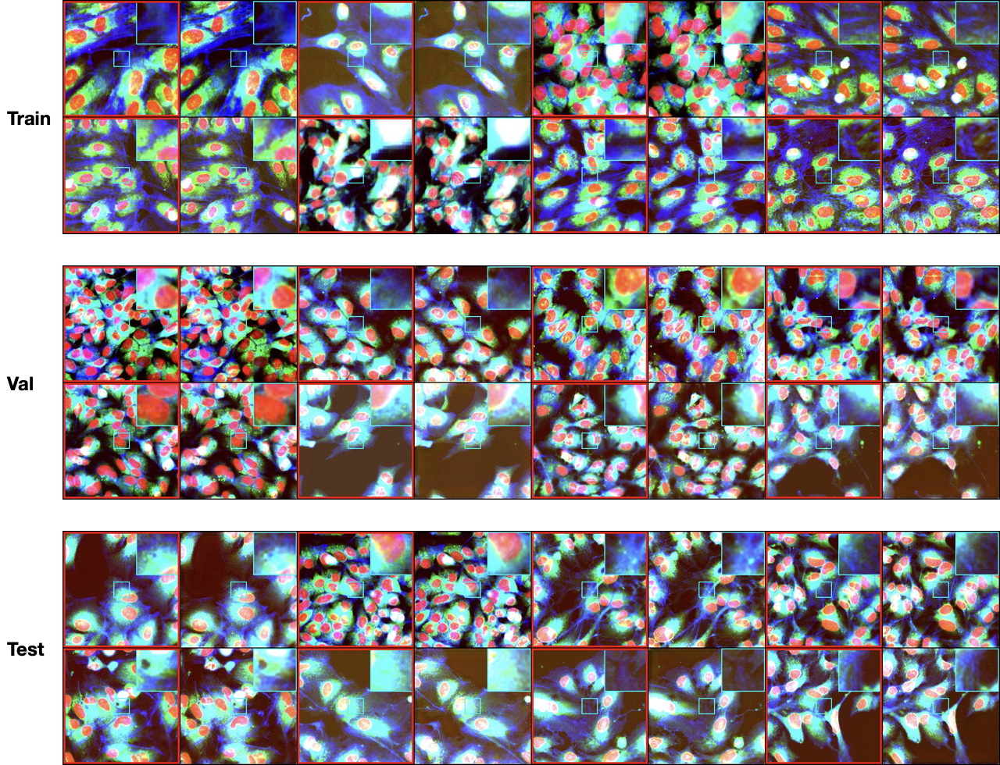

# IID representation learning
Official PyTorch implementation (under development upon reviewers' feedback) for the following manuscript:

[Towards IID representation learning and its application on biomedical data](https://openreview.net/forum?id=qKZH_U-tn9P), MIDL 2022, under review. \
Jiqing Wu, Inti Zlobec, Maxime W Lafarge, Yukun He and Viktor Koelzer.

> Due to the heterogeneity of real-world data, the widely accepted independent and identically distributed (IID) assumption has been criticized in recent studies on causality. In this paper, we argue that instead of being a questionable assumption,  IID is a fundamental task-relevant property that needs to be learned. We elaborate on how a variety of different causal questions can be reformulated to learning a task-relevant function that induces IID, which we term IID representation learning.
>
> For proof of concept, we examine the IID representation learning on Out-of-Distribution (OOD) generalization tasks. Concretely, by utilizing the representation obtained via the learned function that induces IID, we conduct prediction of molecular characteristics (molecular prediction) on two biomedical datasets with real-world distribution shifts introduced by a) preanalytical variation and b) sampling protocol. To enable reproducibility and for comparison to the state-of-the-art (SOTA) methods, this is done by following the OOD benchmarking guidelines recommended from WILDS. Compared to the SOTA baselines supported in WILDS, the results confirm the superior performance of IID representation learning on OOD tasks. 

<p align="center">
  
<br>
The overall model illustrations of the proposed IID representation learning. 
Left:  Restyle Encoder and StyleGAN Decoder. 
Right: The downstream molecular predictor (ERM + IID representation).        
</p>


<a href="https://openreview.net/pdf?id=qKZH_U-tn9P"></a> \
<a href="https://opensource.org/licenses/MIT"></a>  

## WILDS Leaderboard
TODO


## Installation
This implementation is mainly dependent on two backends:  [Restyle](https://https://github.com/yuval-alaluf/restyle-encoder) and [WILDS](https://github.com/p-lambda/wilds). This suggests that, if the dependencies for Restyle and Wilds are installed, then the environment of our code is correctly configured.

**Prerequisites**    
This implementation has been successfully tested under the following configurations,
meanwhile the version range in the parentheses could also work:

- Ubuntu 20.04 (>=18.04)
- Nvidia driver 470.86 (>=450.xx)
- CUDA 11.3 (>=11.0)
- Python 3.9 (>=3.7)
- Miniconda 
- Docker 
- Nvidia-Docker2

After the prerequisites are satisfied, you could either build the docker image
or install conda dependencies.

**Docker Installation**     
Assume Docker and Nvidia-Docker2 toolkit are correctly installed, build the Docker image as follows

```
cd $Path/To/IID_representation_learning/
docker build -t iid .
```

**Conda Installation**      
Assume a local Conda environment is installed and activated, 
assume CUDA is installed to the /usr/local/cuda folder (Please do not install CUDA locally as suggested by PyTorch Conda installation, this may cause errors when StyleGAN calls ninja package.),
install the dependencies as follows   

```
pip install torch==1.10.1+cu113 torchvision==0.11.2+cu113 torchaudio==0.10.1+cu113 -f https://download.pytorch.org/whl/cu113/torch_stable.html

pip install wilds matplotlib opencv-python ninja
```
You could also try creating a conda environment from  [environment.yml](environment.yml).


## Data Preparation
To run the experiments investigated in the paper, we need to download the RxRx1 dataset and some pretrained models

1. Download RxRx1 
    ```
    git clone https://github.com/p-lambda/wilds.git
    cd wilds/
    python wilds/download_datasets.py --root_dir path/to/data --datasets rxrx1
    ```

2. Create [restyle/pretrained_models/](restyle/pretrained_models/) folder and  download the following models to this folder 
    - [MOCO](https://drive.google.com/file/d/1LUvNGzcGpQHS0K9vdSmk4_0RVQSU9zxE/view?usp=sharing)    
    - [StyleGAN](https://drive.google.com/file/d/1iY4mKzInyNGBOY8z1P2FtnfCx966DSfa/view?usp=sharing)
    - [Restyle auto-encoder](https://drive.google.com/file/d/1B_uNnrhhxWHW571-N0eD02lRmVnkgzAN/view?usp=sharing)


## Run the Experiments
In case of using Docker image, you could first launch the Docker image

**Launch the Docker Image**
```
sudo docker run -it \
    # this folder stores the pretrained weights of some standard backbones
    # that may be used during training
    -v /Path/To/.cache/torch/hub/checkpoints:/root/.cache/torch/hub/checkpoints/ \
    -v /Path/To/IID_representation_learning:/root/iid \
    -v /Path/To/Data:/root/Data \
    --gpus '"device=0"'  iid
```


**The Training of Molecular Prediction**
```
python main.py -m train \
               -e 150 \
               --seed 0 \
               --lr cosine,1.5e-4,90,6e-5,150,0 \
               --backbone resnet50 \
               --data_type rxrx1 \
               --classes 1139 \
               --split_scheme official \
               --batch_size 24 \
               --eval_batch_size 64 \
               --data /Path/To/Data/ \
               --save /Path/To/Save/ \
               --checkpoint_path restyle/pretrained_models/ --save-model --loss-coef 0.15 --noise --style
```

**The Training of IID representation (Restyle auto-encoder)**
```
cd restyle

python scripts/train_restyle_psp.py \
    --dataset_type=rxrx1 \
    --split_scheme=official \
    --encoder_type=ResNetBackboneEncoder \
    --exp_dir=/Path/To/Output \
    --workers=8 \
    --batch_size=8 \
    --test_batch_size=8 \
    --test_workers=8 \
    --max_steps=100000 \
    --val_interval=5000 \
    --image_interval=5000 \
    --save_interval=10000 \
    --start_from_latent_avg \
    --lpips_lambda=0.2 \
    --l2_lambda=5 \
    --w_norm_lambda=0 \
    --id_lambda=0 \
    --moco_lambda=0.2 \
    --input_nc=6 \
    --n_iters_per_batch=1 \
    --output_size=256 \
    --stylegan_weights=pretrained_models/rxrx1_100000.pt
```

**The Training of StyleGAN**    
See https://github.com/rosinality/stylegan2-pytorch for more details about creating the lmdb datasets with 256X256 resolution (such as RxRx1) and running the training script. 

## Visualization
**The Image Synthesis of StyleGAN**
```
python main.py -m synth \
               --data_type rxrx1 \
               --classes 1139 \
               --split_scheme official \
               --batch_size 32 \
               --data /Path/To/Data/ \
               --save /Path/To/Save/ \
               --checkpoint_path restyle/pretrained_models/ 
```


<p align="center">
  
<br>
Nonexistent fluorescence images synthesized by StyleGAN learned with RxRx1 training
data.        
</p>


**The Reconstruction of Restyle Auto-encoder**
```
python main.py -m recon \
               --data_type rxrx1 \
               --classes 1139 \
               --split_scheme official \
               --batch_size 16 \
               --eval_batch_size 16 \
               --data /Path/To/Data/ \
               --save /Path/To/Save/ \
               --checkpoint_path restyle/pretrained_models/
```


<p align="center">
  
<br>
The visual comparison between ground-truth (red bounding
box) and reconstructed RxRx1 images. After running the above implementation, additional post-processing steps are requried to normalize the
images along each channel and zoom in on a small region for better visualization.   
</p>

## Acknowledgments
This implementation is built upon [Restyle](https://https://github.com/yuval-alaluf/restyle-encoder) and [WILDS](https://github.com/p-lambda/wilds) projects.
Besides, our code also borrows from [kaggle-rcic-1st](https://github.com/maciej-sypetkowski/kaggle-rcic-1st). We would like to convey our gratitudes to all the authors working on those projects.
